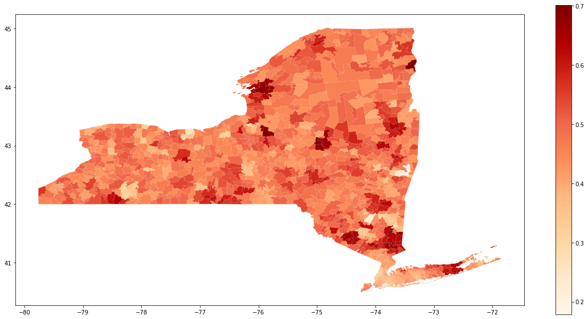

# Used Car Playground


This is the repo for Used Car Playground project  

Used Car Playground project is a research project related to used car data

Map Data is obtained from [ArcGIS, shared by ESRI](https://www.arcgis.com/home/item.html?id=8d2012a2016e484dafaac0451f9aea24)

To run the scrapy spyder in usedcar folder:
```bash
scrapy crawl usedcar
```

To visualize the data, run the following in root directory:
```bash
jupyter notebook "Used Car Playground.ipynb"
```